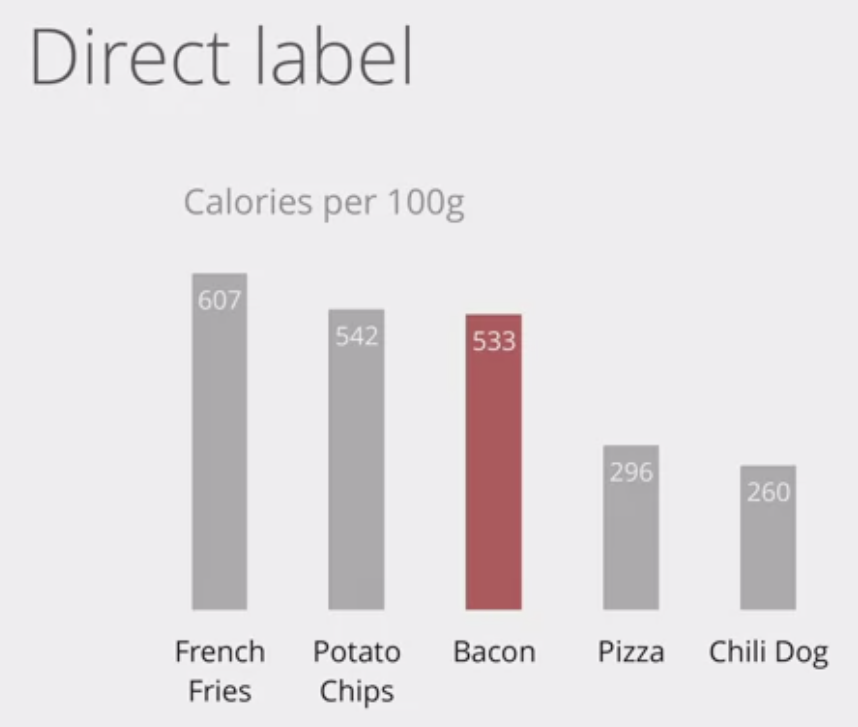

# Applied Plotting, Charting & Data Representation in Python

## 강의 계획

- Week1 - 시각화 이론 / [Graphics Lies, Misleading Visuals](https://faculty.ucmerced.edu/jvevea/classes/Spark/readings/Cairo2015_Chapter_GraphicsLiesMisleadingVisuals.pdf)
- Week2 - 기본 Charting
- Week3 - Charting Fundamentals
- Week4 - Raw data 에서 시각화까지

<br><br>

## Visualization Wheel Dimension(Alberto Cairo)
<br>


<br><br>

## Graphical heuristics: Data-ink ratio (Edward Tufte)
<br>

|변경 전|변경 후|
|:-:|:-:|
|||

<br>
제목, 범주, 수치 등등을 제거하여 더 간결하고 효과적인 그래프로 나타낼 수 있다.

$$\text{Data-Ink Ratio} = \frac{\text{amount of data-ink}}{\text{total ink required to print the graphic}}$$

<br><br>

## Graphical heuristics: Chart junk (Edward Tufte)
<br>

무작정 단순히 하는게 좋은 건 아님. 좀 더 효과적인 기억에 도움을 주는 그림, 표, 색상 등이 있을 수 있다.

<br><br>

---

<br><br>

# 교수님 자료

$$T = max_{(\alpha_1, \alpha_2)\in\mathcal{A}} \frac{\alpha_1Z_1 + \alpha_2Z_2}{\sqrt{\alpha'\Sigma\alpha}}$$

$\alpha$ 에 따라서 평균만 변하는 정규분포를 따름을 알 수 있다.

<br>

1. 이변량 정규분포 랜덤샘플 생성 패키지

```r
install.packages('mvtnorm')
library(mvtnorm)
```

2. quantile t

```r
mu = c(1,5); sigma = matrix(c(1,0.5,0.5,1), 2, 2)
sample = rmvnorm(1000, mean = mu, sigma = sigma)

## analytically
t = qnorm(0.05, (mu[1]^2+mu[2]^2)/(mu[1]+mu[2]), 1, lower.tail=FALSE)

## numerically
T = vector()
for (i in 1:n) {
    if (sample[i,1] >= sample[i,2]) {
    T[i] = sample[i,1]
    } else {
    T[i] = sample[i,2]
    }
}
T=sort(T, decreasing=TRUE)
for (i in seq(9,1,-0.01)) {
    if ((sum(T>=i)/1000)>=0.049) {
    t = i
    break
    }
}
t
```

3. Power of test

```r
### [2] Power of test
mu = c(1,5); sigma = matrix(c(1,0.5,0.5,1), 2, 2)
c = qchisq(0.025, df=2, lower.tail=FALSE)
lmbd = 0.5 * t(mu) %*% solve(sigma) %*% mu

## Chi
# 1보다 크면 1
pwr_chi = pnorm((c-(2+2*lmbd))/(4+8*lmbd), 0, 1, lower.tail = FALSE) + pnorm(-(c-(2+2*lmbd))/(4+8*lmbd), 0, 1, lower.tail = TRUE)
pwr_chi

## T
pwr_t = pnorm(c ,0,1,lower.tail=FALSE) + pnorm(2*(mu[1]^2+mu[2]^2)/(mu[1]+mu[2])-c ,0,1,lower.tail=TRUE)
pwr_t
```